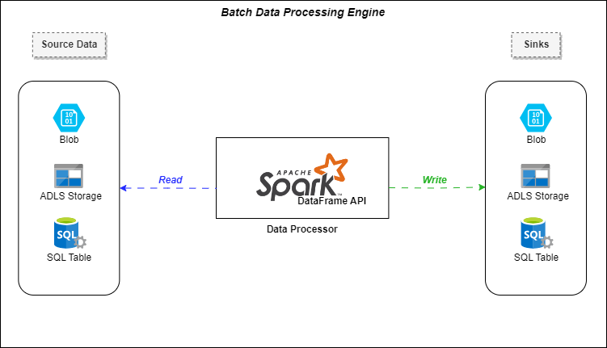
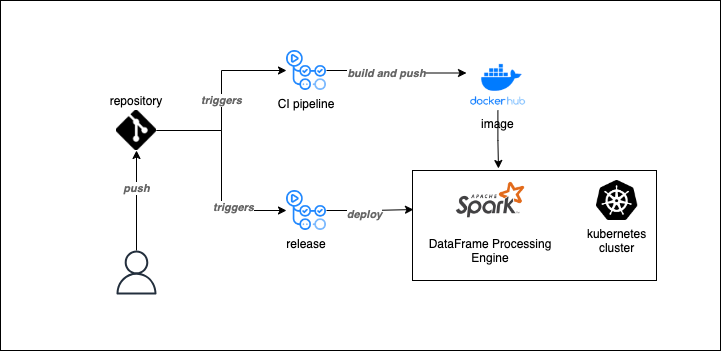

# Batch Data Processing Engine

# Introduction
This document describes a data processing engine used to collect data in batches from different sources, process that data and then write it down towards one of many possible sinks. The engine is built with Java on top of the Spark framework using its DataFrame API.

## 1) Architecture


## 2.1) Data Processing Engine
The engine is a Spark application that enables reading data from different types of inputs:
- CSV
- Parquet
- SQL Table
- Azure Data Lake Storage Blobs

Later in the process, the input read data gets transformed and then could be written to the following set of outputs:
- CSV
- Parquet
- SQL Table
- Azure Data Lake Storage Blobs

Keep in mind that this engine is built on top of the Spark DataFrame API. Hence, any transformation logic gets handled within the application code itself.

As of the latest version, one default transformation logic is supported and does nothing else than keeping the input data as of the same format. Any additional and/or specific transformations must be implemented by the development team.
Additionally, configuring the application's data flow relies on program arguments. Samples can be found in the [Program Arguments Samples Directory](Program%20Arguments%20Samples)
## 2.2) Deployment process
The engine's continuous integration and continuation deployment process consists of two main steps:
1. Building and pushing a docker image containing the application's shaded JAR along with the required Java and Spark dependencies.
2. Deploying the previous cited docker image into a staging kubernetes cluster.

Both workflows are handled through github actions. Templates for each workflow can be found under:
- [CI pipeline](.github/workflows/build-docker.yml)
- [CD release](.github/workflows/release-minikube.yml)



# Local Setup
Once the repository is cloned, you can navigate first towards the project's root directory.

```bash
# replace this path with the appropriate one depending on your project's location
cd /path/to/project
```
## Docker Deployment
Run the following command in order to run a docker container.
Make sure to replace both arguments with the appropriate absolute paths towards your desired input and output data folders.
```bash
# replace both arguments
bash Build/local/buildAndRun.sh /path/to/project/Data_Spark_DF_Application/src/test/resources/data/input /path/to/project/Data_Spark_DF_Application/src/test/resources/data/output
```
## Kubernetes Release
If you have a kubernetes cluster, you can also use the project's deployment template to run a pod for the application execution.
The example below covers the deployment steps to a local minikube cluster.

Start first with mounting your local data directory to the minikube's file system.
```bash
# replace the mounted path directory with your corresponding location
minikube mount path/to/project/Data_Spark_DF_Application/src/test/resources/data:/data
```
Apply kubernetes deployment template
```bash
# deploy to kubernetes
kubectl apply -f deploy/local/batch-df-processing-engine-deployment.yaml
```
Consult application logs
```bash
# replace the pod id
kubectl logs -f POD_ID
```